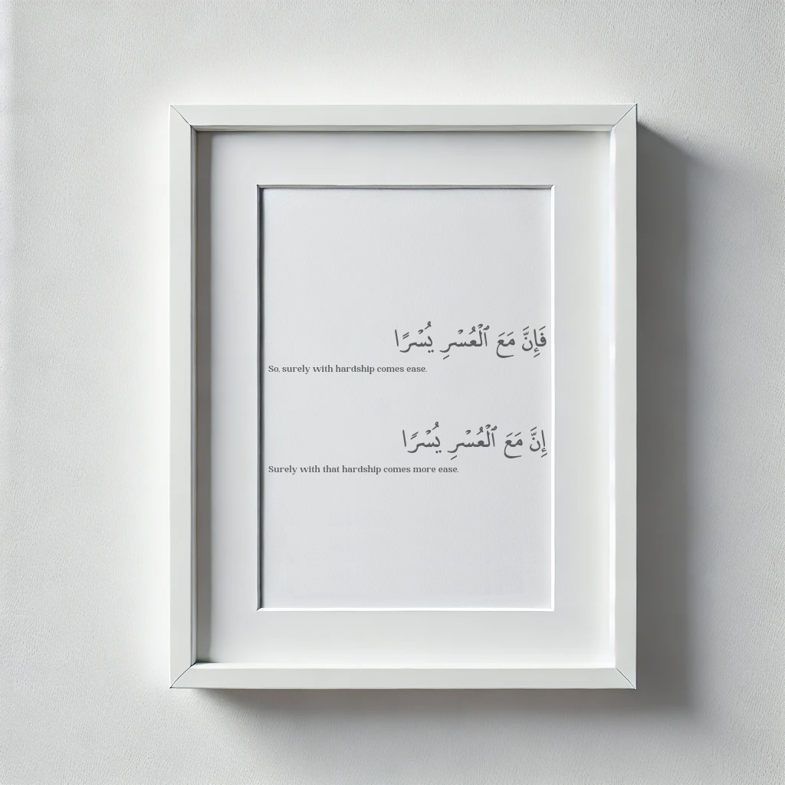
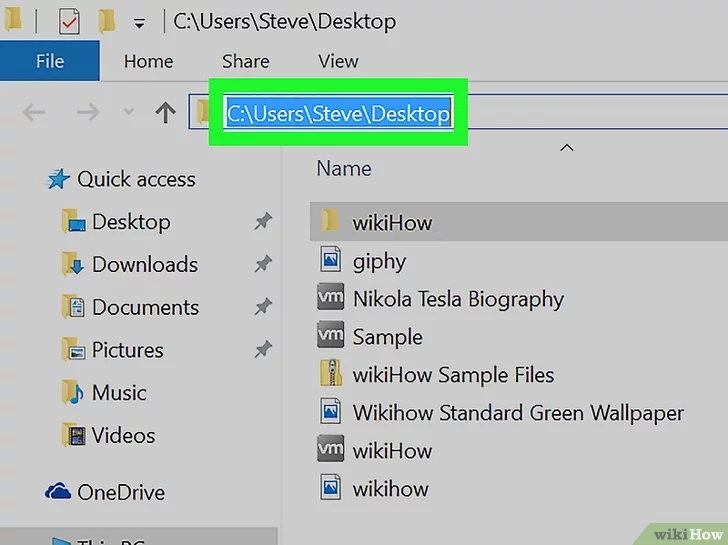

<!--
Zeyad Abbas
Quran Image Generator
-->

<!-- PROJECT SHIELDS -->
<!-- [![Contributors][contributors-shield]][contributors-url] -->
<!-- [![Forks][forks-shield]][forks-url] -->
<!-- [![Stargazers][stars-shield]][stars-url] -->
<!-- [![Issues][issues-shield]][issues-url] -->
<!-- [![MIT License][license-shield]](https://github.com/ZeyadAbbas/quran-image-generator/blob/master/LICENSE.txt) -->
[![LinkedIn][linkedin-shield]](https://www.linkedin.com/in/zeyad-abbas-/)


<!-- PROJECT LOGO -->
<br />
<div align="center">
  <a href="https://github.com/ZeyadAbbas/quran-image-generator">
    
  </a>

<h3 align="center">Quran Image Generator</h3>

  <p align="center">
    Create custom Quran images in seconds!
    <br />
    <a href="https://github.com/github_username/repo_name"><strong>Explore the docs »</strong></a>
    <br />
    <br />
    <!--<a href="https://github.com/github_username/repo_name">View Demo</a>-->
    <a href="https://github.com/github_username/repo_name/issues/new?labels=bug&template=bug-report---.md">Report Bug</a>
    ·
    <a href="https://github.com/github_username/repo_name/issues/new?labels=enhancement&template=feature-request---.md">Request Feature</a>
  </p>
</div>


<!-- TABLE OF CONTENTS -->
<details>
  <summary>Table of Contents</summary>
  <ol>
    <li>
      <a href="#about-the-project">About The Project</a>
      <ul>
        <li><a href="#built-with">Built With</a></li>
      </ul>
    </li>
    <li>
      <a href="#getting-started">Getting Started</a>
      <ul>
        <li><a href="#prerequisites">Prerequisites</a></li>
        <li><a href="#installation">Installation</a></li>
      </ul>
    </li>
    <li><a href="#usage">Usage</a></li>
    <li><a href="#roadmap">Roadmap</a></li>
    <li><a href="#contributing">Contributing</a></li>
    <li><a href="#license">License</a></li>
    <li><a href="#contact">Contact</a></li>
    <li><a href="#acknowledgments">Acknowledgments</a></li>
  </ol>
</details>


<!-- ABOUT THE PROJECT -->
## About The Project

These are some images made using this program, and there are countless other possibilities.
<div style="display: flex; justify-content: space-around; align-items: center;">
  
  
  
</div>

<div style="display: flex; justify-content: space-around; align-items: center;">
  
  
</div>

The aim of this program is to provide people with 0 prior coding knowledge 
with the ability to create custom Quran images to be shared online or for personal use.

The program should not take longer than 3 minutes to set up and configure. Once setup is done,
you have the ability to create countless images. Below are all the steps to get started.

##### This program is in beta. It may return errors if not used properly. The code and the way it works is subject to change.
<p align="right">(<a href="#readme-top">back to top</a>)</p>


<!--### Built With -->
<!-- -->
<!--* [![Next][Next.js]][Next-url] -->
<!--* [![React][React.js]][React-url] -->
<!--* [![Vue][Vue.js]][Vue-url] -->
<!--* [![Angular][Angular.io]][Angular-url] -->
<!--* [![Svelte][Svelte.dev]][Svelte-url] -->
<!--* [![Laravel][Laravel.com]][Laravel-url] -->
<!--* [![Bootstrap][Bootstrap.com]][Bootstrap-url] -->
<!--* [![JQuery][JQuery.com]][JQuery-url] -->

<!-- <p align="right">(<a href="#readme-top">back to top</a>)</p> -->


<!-- GETTING STARTED -->
## Getting Started

These instructions are all you need to get the program up and running. 
They also include all the information about the configuration options.

### Installation

You must have Python installed to run this program. \
If you don't have it installed then go to https://www.python.org/downloads/ to get the latest version of Python.

1. Once you have installed Python, you must open your Command Prompt and run the command:
    ```sh
    pip install setuptools
    ```
   It may tell you that you already have it installed, that's fine.


2. Then download the program from this GitHub if you haven't already.
Make sure you know where you downloaded it.


3. Open the program's folder that you just downloaded, press on the top address bar, and type `cmd`.
   <div style="display: flex; justify-content: space-around; align-items: center;">
     
   </div>

   This will open a command prompt that only sees files within the program directory.


4. To download all the necessary libraries for the program to function, run:
   ```sh
   python install .
   ```
   
5. Now you should be ready to start the program. From now on all you have to do is
open the command prompt from your program directory like done in step 3, 
then run:
   ```sh
   python main.py
   ```
   This will start the program. Now you are ready to generate custom pictures.

<!-- ### Installation -->
<!-- --> 
<!-- 1. Get a free API Key at [https://example.com](https://example.com) -->
<!-- 2. Clone the repo -->
<!--    ```sh -->
<!--    git clone https://github.com/github_username/repo_name.git -->
<!--    ``` -->
<!-- 3. Install NPM packages -->
<!--    ```sh -->
<!--    npm install -->
<!--    ``` -->
<!-- 4. Enter your API in `config.js` -->
<!--    ```js -->
<!--    const API_KEY = 'ENTER YOUR API'; -->
<!--    ``` -->
<!-- 5. Change git remote url to avoid accidental pushes to base project -->
<!--    ```sh -->
<!--    git remote set-url origin github_username/repo_name -->
<!--    git remote -v # confirm the changes -->
<!--    ``` -->
<!-- --> 
<p align="right">(<a href="#readme-top">back to top</a>)</p>


<!-- USAGE EXAMPLES -->
## Usage

The program has a file that you need to open to customize the images, that file is `config.yaml`.
In there, there are options to change with descriptions next to them acting as documentation.

The program uses the [Quran.com](https://quran.com/1) api to get all the verses and their translations,
this means that if a language is supported by Quran.com, then it's supported by the program.

Here is a list of supported languages, and their ISO codes, that you need for the config file to use them.

| Language | Code    | Translation Name |
|----------|---------|------------------|
| Sufian   | Skamsit | Strranslit       |
|          |         |                  |
|          |         |                  |

_For more examples, please refer to the [Documentation](https://example.com)_

<p align="right">(<a href="#readme-top">back to top</a>)</p>


<!-- To Do -->
## To Do

- [ ] Add the ability to post automatically based on an interval
- [ ] Add bounds to ensure no errors occur
- [ ] Create program to test all config options
- [ ] Comment code
    - [ ] Add error logs

See the [open issues](https://github.com/ZeyadAbbas/quran-image-generator/issues) for a full list of proposed features (and known issues).

<p align="right">(<a href="#readme-top">back to top</a>)</p>


<!-- CONTRIBUTING -->
## Contributing

Contributions are what make the open source community such an amazing place to learn, inspire, and create. Any contributions you make are **greatly appreciated**.

If you have a suggestion that would make this better, please fork the repo and create a pull request. You can also simply open an issue with the tag "enhancement".
Don't forget to give the project a star! Thanks again!

1. Fork the Project
2. Create your Feature Branch (`git checkout -b feature/AmazingFeature`)
3. Commit your Changes (`git commit -m 'Add some AmazingFeature'`)
4. Push to the Branch (`git push origin feature/AmazingFeature`)
5. Open a Pull Request

<p align="right">(<a href="#readme-top">back to top</a>)</p>

<!-- ### Top contributors: -->
<!-- --> 
<!-- <a href="https://github.com/github_username/repo_name/graphs/contributors"> -->
<!--    -->
<!-- </a> -->


<!-- LICENSE -->
## License

Distributed under the MIT License. See `LICENSE.txt` for more information.

<p align="right">(<a href="#readme-top">back to top</a>)</p>


<!-- CONTACT -->
## Contact

Zeyad Abbas - zeyadabbas238@gmail.com

Project Link: [https://github.com/ZeyadAbbas/quran-image-generator](https://github.com/ZeyadAbbas/quran-image-generator)

<p align="right">(<a href="#readme-top">back to top</a>)</p>


<!-- ACKNOWLEDGMENTS -->
## Acknowledgments

* [Quran.com](https://quran.com/1)
* [me_quran Quran Font](https://tanzil.net/docs/me_quran_font)
* [Different Language Fonts](https://fonts.google.com/noto)

<p align="right">(<a href="#readme-top">back to top</a>)</p>


<!-- MARKDOWN LINKS & IMAGES -->
<!-- https://www.markdownguide.org/basic-syntax/#reference-style-links -->
[contributors-shield]: https://img.shields.io/github/contributors/github_username/repo_name.svg?style=for-the-badge
[contributors-url]: https://github.com/github_username/repo_name/graphs/contributors
[forks-shield]: https://img.shields.io/github/forks/github_username/repo_name.svg?style=for-the-badge
[forks-url]: https://github.com/github_username/repo_name/network/members
[stars-shield]: https://img.shields.io/github/stars/github_username/repo_name.svg?style=for-the-badge
[stars-url]: https://github.com/github_username/repo_name/stargazers
[issues-shield]: https://img.shields.io/github/issues/github_username/repo_name.svg?style=for-the-badge
[issues-url]: https://github.com/github_username/repo_name/issues
[license-shield]: https://img.shields.io/github/license/github_username/repo_name.svg?style=for-the-badge
[license-url]: https://github.com/ZeyadAbbas/quran-image-generator/blob/master/LICENSE.txt
[linkedin-shield]: https://img.shields.io/badge/-LinkedIn-black.svg?style=for-the-badge&logo=linkedin&colorB=555
[linkedin-url]: https://linkedin.com/in/linkedin_username
[ex1]: readme_images/ex1.png
[ex2]: readme_images/ex2.png
[ex3]: readme_images/ex3.png
[ex4]: readme_images/ex4.png
[Next.js]: https://img.shields.io/badge/next.js-000000?style=for-the-badge&logo=nextdotjs&logoColor=white
[Next-url]: https://nextjs.org/
[React.js]: https://img.shields.io/badge/React-20232A?style=for-the-badge&logo=react&logoColor=61DAFB
[React-url]: https://reactjs.org/
[Vue.js]: https://img.shields.io/badge/Vue.js-35495E?style=for-the-badge&logo=vuedotjs&logoColor=4FC08D
[Vue-url]: https://vuejs.org/
[Angular.io]: https://img.shields.io/badge/Angular-DD0031?style=for-the-badge&logo=angular&logoColor=white
[Angular-url]: https://angular.io/
[Svelte.dev]: https://img.shields.io/badge/Svelte-4A4A55?style=for-the-badge&logo=svelte&logoColor=FF3E00
[Svelte-url]: https://svelte.dev/
[Laravel.com]: https://img.shields.io/badge/Laravel-FF2D20?style=for-the-badge&logo=laravel&logoColor=white
[Laravel-url]: https://laravel.com
[Bootstrap.com]: https://img.shields.io/badge/Bootstrap-563D7C?style=for-the-badge&logo=bootstrap&logoColor=white
[Bootstrap-url]: https://getbootstrap.com
[JQuery.com]: https://img.shields.io/badge/jQuery-0769AD?style=for-the-badge&logo=jquery&logoColor=white
[JQuery-url]: https://jquery.com 
