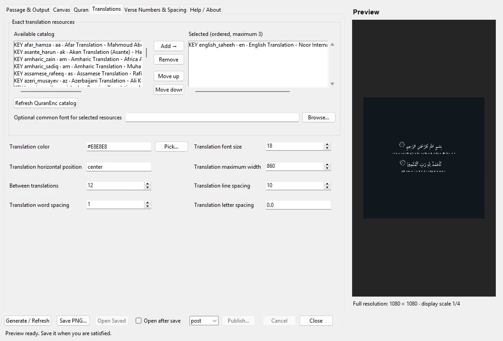
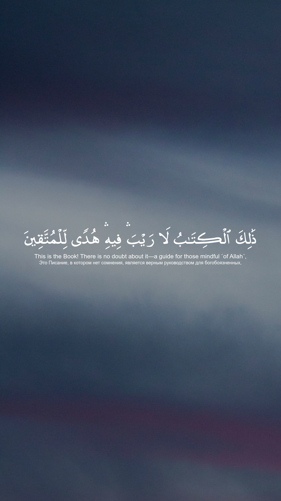
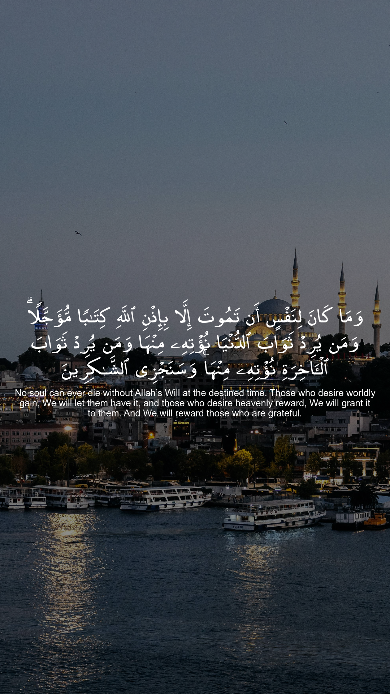
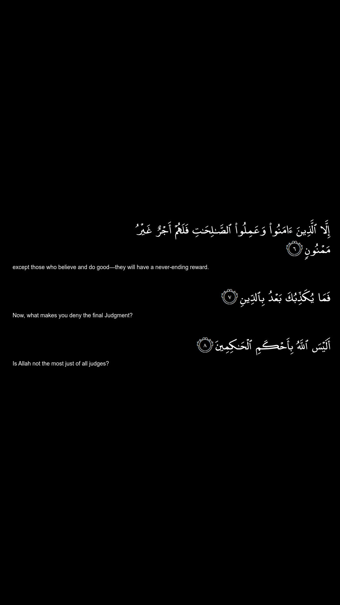
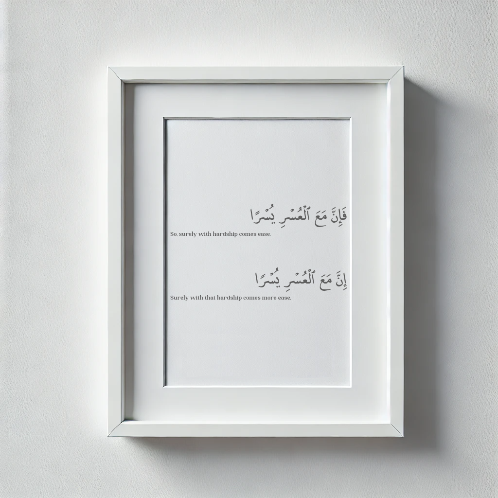

# Quran Image Generator

<p align="center">
  
</p>

Create customizable PNG images from Quran passages with a desktop app or a
command-line workflow. Arabic Quran text and chapter metadata are bundled from
the Tanzil Project, so Arabic-only generation works offline and requires no
account, API key, or secret. Optional translations are discovered and retrieved
from QuranEnc.

> **Release status:** the project is usable from a source checkout and is under
> active development. There is no public PyPI package or published release yet.

## What it includes

- A desktop GUI for passage selection, complete layout editing, previewing,
  saving, and optional confirmed Instagram publishing.
- Interactive and one-shot CLI modes, including random passage generation and
  headless operation.
- Bundled Arabic text, up to three ordered QuranEnc translations, bundled
  fonts, verse-number artwork, backgrounds, colors, spacing, and positioning.
- Validated YAML configuration, a non-root CLI Docker image, and offline tests
  and render smoke checks.

### Desktop app



### Example outputs

The same passage can be presented in very different ways by changing the
canvas, typography, colors, spacing, verse markers, and translations.

<p align="center">
  
  
  
</p>

<p align="center">
  
  
</p>

## Requirements

- Python 3.10 through 3.14.
- [ImageMagick](https://imagemagick.org/script/download.php) and its native
  libraries. See the [Wand installation guide](https://docs.wand-py.org/en/latest/guide/install.html).
- [Tk](https://docs.python.org/3/library/tkinter.html) and a graphical display
  for the desktop app. The CLI itself does not require Tk.
- Network access only when listing or using optional translations.

## Quick start: desktop app

Install ImageMagick, then clone this repository:

```sh
git clone https://github.com/ZeyadAbbas/quran-image-generator.git
cd quran-image-generator
```

Create an isolated [virtual environment](https://docs.python.org/3/library/venv.html)
from the repository root.

**Windows PowerShell**

```powershell
py -m venv .venv
.venv\Scripts\Activate.ps1
python -m pip install --upgrade pip
python -m pip install -e .
quran-image-generator-gui
```

**Linux (POSIX shell)**

```sh
python3 -m venv .venv
. .venv/bin/activate
python -m pip install --upgrade pip
python -m pip install -e .
quran-image-generator-gui
```

No setup prompt or content credential is required. Use
`quran-image-generator-gui --config path/to/config.yaml` to start with a
different configuration file. Choose a chapter and verse range, adjust the
layout, and select **Generate / Refresh**. **Save PNG…** always opens a save
dialog; the configured output directory is its suggested starting location.
Any edit makes the current preview stale until it is regenerated. Publishing
is never implicit and requires confirmation in the app.

The GUI exposes the normal generation settings documented in
[`docs/configuration.md`](docs/configuration.md). It can load and save YAML,
open the most recently saved PNG, and includes its own Help / About tab. To
verify Tk and the current display independently, run `python -m tkinter`.

## Content sources

The package includes the verbatim Tanzil Uthmani Quran text, version 1.1, and
Tanzil chapter metadata, version 1.0. The text is verified at runtime with this
SHA-256 digest:

```text
bf4f57b968d03f4131c070b1e285da9be0e0a108a21c910e872801ca273312c8
```

The files are distributed under the Creative Commons Attribution 3.0 license.
Their original notice is preserved, and attribution details are recorded in
[`THIRD_PARTY_NOTICES.md`](THIRD_PARTY_NOTICES.md).

Translations are not bundled. The app retrieves selected translations and
their version metadata from [QuranEnc](https://quranenc.com/) at runtime. If
that service or the network is unavailable, the GUI remains usable for
Arabic-only images. Translation material remains subject to
[QuranEnc's terms](https://quranenc.com/en/terms).

## QuranScribe caption integration

Renderer 0.3.x exposes a versioned static-caption Python/JSON API. It supports
verified partial source spans, reviewed offline English bindings, independent
transparent title/caption/logo assets and isolated batches. Start with
`quran-caption-render --capabilities` and `--preflight`; see
[the independent install guide](docs/integration-install.md) and
[API v1](docs/render-api-v1.md). Styling is supplied by each request; the app does
not install a QuranScribe preset or change its still-image defaults. The
[sample-video handoff](docs/quranscribe-handoff.md) provides measured request
options, font identities, translation requirements and composition instructions.

## Command line

Run the CLI as either `quran-image-generator` or
`python -m quran_image_generator`.

```sh
# Repeating interactive prompts; generated images open by default
quran-image-generator

# One passage; one-shot modes do not open the image by default
quran-image-generator --chapter 1 --start 1 --end 7

# One random passage, then open it
quran-image-generator --random --open

# Explicit headless output location
quran-image-generator --chapter 2 --start 255 --end 255 --no-open --output-dir outputs

# Select a configuration file explicitly
quran-image-generator --config config.yaml --chapter 1 --start 1 --end 1
```

`--chapter`, `--start`, and `--end` must be supplied together. They cannot be
combined with `--random`. With no selector, the CLI repeatedly prompts for a
passage and asks whether to continue. One-shot modes generate once and exit.
Use `--open` or `--no-open` to override each mode's default.

Generated names are `<Chapter> <first> - <last>.png` (or
`<Chapter> <verse>.png`). Repeating the same passage in the same directory may
overwrite the earlier file. A config-relative output path is resolved beside
the selected config file; a relative `--output-dir` override is resolved from
the current working directory.

### Translation catalog

List the current QuranEnc translation catalog:

```sh
quran-image-generator --list-translations
quran-image-generator --list-translations --refresh-catalog
```

List mode cannot be combined with passage selectors, `--random`, output/open
overrides, or publishing. Choose at most three resources in `config.yaml`; their
order is preserved. Prefer an exact `key`, such as `english_saheeh`. A
`language` selector works only when that language has exactly one resource;
otherwise the application reports the exact choices. Use
`translation languages: []` to create Arabic-only images. See
[configuration](docs/configuration.md#translations) for examples.

## Docker (CLI only)

The image runs as non-root user `10001:10001` and intentionally contains no GUI
or display stack. Build it from the repository root:

```sh
docker build --target runtime -t quran-image-generator .
mkdir -p outputs
docker run --rm \
  --user "$(id -u):$(id -g)" --env HOME=/tmp \
  --mount type=bind,src="$(pwd)/config.yaml",dst=/config/config.yaml,readonly \
  --mount type=bind,src="$(pwd)/outputs",dst=/output \
  quran-image-generator \
  --config /config/config.yaml --output-dir /output --no-open \
  --chapter 1 --start 1 --end 1
```

Mount any custom background or font separately as read-only and reference its
container path in YAML. Docker Desktop's Linux-container bind mounts on Windows
are not covered by CI; use Docker's
[bind-mount guidance](https://docs.docker.com/engine/storage/bind-mounts/) with
absolute host paths.

## Optional Instagram publishing

From this source checkout, install the optional extra:

```sh
python -m pip install -e ".[instagram]"
```

Set `QIG_INSTAGRAM_USERNAME` and `QIG_INSTAGRAM_PASSWORD`, then opt in per run
with `--publish post` or `--publish story`. A CLI attached to a terminal may
prompt for missing Instagram credentials (with a hidden password); the GUI
never prompts for them. Publishing is attempted only after the PNG is saved,
and a publishing failure does not remove the local file.

## Configuration and help

- [`config.yaml`](config.yaml) is a working, annotated example.
- [`docs/configuration.md`](docs/configuration.md) is the canonical setting
  reference, including defaults, ranges, paths, and translation selectors.
- [`docs/troubleshooting.md`](docs/troubleshooting.md) covers content,
  ImageMagick, Tk, fonts, layout, Docker, and publishing failures.
- [`docs/gui-smoke-test.md`](docs/gui-smoke-test.md) is the manual GUI release
  smoke checklist.

## Development

Install from a checkout with the development extra, then run the checks:

```sh
python -m pip install -e ".[dev]"
python -m pytest
python -m ruff check .
python -m mypy
python -m compileall -q -f src
python -m build
python scripts/verify_artifacts.py
```

Tests run without external network access. A separate manual smoke test covers
the current QuranEnc catalog and translation responses.

Caption regression fixtures and the six-reference preview sheet are documented
in [caption regressions](docs/caption-regressions.md). Creator assets and visual
approval remain explicit pending inputs.

## License and support

The application code is released under the [MIT License](LICENSE.txt).
Third-party data and assets retain their own licenses; see
[`THIRD_PARTY_NOTICES.md`](THIRD_PARTY_NOTICES.md). Please use
[GitHub Issues](https://github.com/ZeyadAbbas/quran-image-generator/issues) for
reproducible bugs and focused feature requests, but redact personal paths and
private generated content.

Arabic Quran text and metadata come from the
[Tanzil Project](https://tanzil.net/). Optional translations come from
[QuranEnc](https://quranenc.com/). The bundled Arabic typeface comes from
[me_quran](https://tanzil.net/docs/me_quran_font), and multilingual fonts come
from [Google Noto Fonts](https://fonts.google.com/noto).
