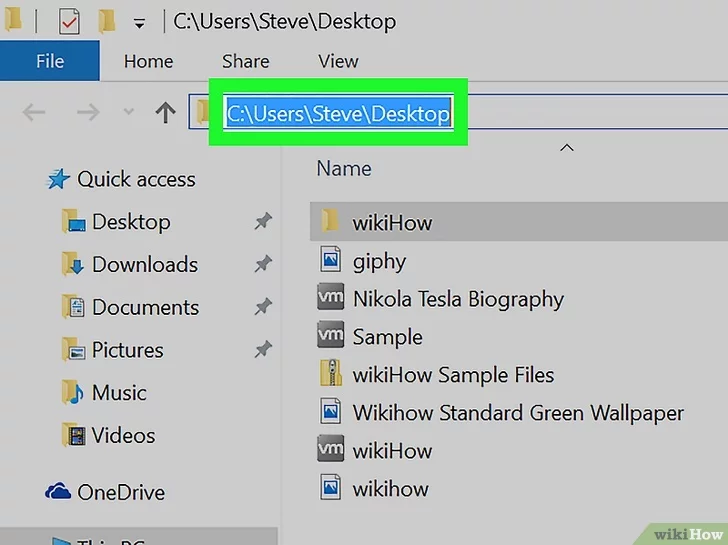

<!--
Zeyad Abbas
Quran Image Generator
-->

<!-- PROJECT SHIELDS -->
<!-- [![Contributors][contributors-shield]][contributors-url] -->
<!-- [![Forks][forks-shield]][forks-url] -->
<!-- [![Stargazers][stars-shield]][stars-url] -->
<!-- [![Issues][issues-shield]][issues-url] -->
<!-- [![MIT License][license-shield]](https://github.com/ZeyadAbbas/quran-image-generator/blob/master/LICENSE.txt) -->

#### ⛔ Due to breaking changes to the Quran.com API, this project NO LONGER WORKS. Updates will be made accordingly. ⛔ 

<!-- PROJECT LOGO -->
<br />
<div align="center">
  <a href="https://github.com/ZeyadAbbas/quran-image-generator">
    
  </a>

<h3 align="center">Quran Image Generator</h3>

  <p align="center">
    Create custom Quran images in seconds!
    <br />
    <a href="#getting-started"><strong>How To Setup »</strong></a>
    <br />
    <br />
    <!--<a href="https://github.com/github_username/repo_name">View Demo</a>-->
    <a href="https://github.com/ZeyadAbbas/quran-image-generator/issues/new?labels=bug&template=bug-report---.md">Report Bug</a>
    ·
    <a href="https://github.com/ZeyadAbbas/quran-image-generator/issues/new?labels=enhancement&template=feature-request---.md">Request Feature</a>
  </p>
</div>


<!-- TABLE OF CONTENTS -->
<details>
  <summary>Table of Contents</summary>
  <ol>
    <li>
      <a href="#about-the-project">About The Project</a>
    </li>
    <li>
      <a href="#getting-started">Getting Started</a>
      <!-- <ul> -->
      <!--   <li><a href="#installation">Installation</a></li> -->
      <!-- </ul> -->
    </li>
    <li><a href="#usage">Usage</a></li>
    <li><a href="#to-do">To Do</a></li>
    <li><a href="#contributing">Contributing</a></li>
    <li><a href="#license">License</a></li>
    <li><a href="#contact">Contact</a></li>
    <li><a href="#acknowledgments">Acknowledgments</a></li>
  </ol>
</details>


<!-- ABOUT THE PROJECT -->
## About The Project

The aim of this program is to provide people with 0 prior coding knowledge 
the ability to create custom Quran images to be shared online or for personal use.

The program allows you to generate a quran verse, translations of your choice, and then post them 
just by typing 3 sets of numbers: the chapter, the first verse, and the last verse.
This makes the generation process incredibly easy, especially when you want to make a lot of them.

Without this program, you would need to use something like [Photoshop](https://www.adobe.com/products/photoshop.html) 
or [Pixlr](https://pixlr.com/editor/) to make something like it. Both these options are paid to an extent
and take much more time to obtain the same result.

These are some images made using this program, and there are countless other possibilities.
<div style="display: flex; justify-content: space-around; align-items: center;">
  
  
  
</div>
<div style="display: flex; justify-content: space-around; align-items: center;">
  
  
</div>


That's where my problem was. I wanted to make these images, but I didn't want to do all the work every time.
This is why I have created this program for the public use, so it's easy for myself and everyone
who may want to do the same.

The program should not take longer than 3 minutes to set up and configure. Once setup is done,
you have the ability to create countless custom images. Below are all the steps to get started.

##### This program is in beta. It may return errors if not used properly. The code and the way it works is subject to change.
<p align="right">(<a href="#about-the-project">back to top</a>)</p>


<!-- GETTING STARTED -->
## Getting Started

These instructions are all you need to get the program up and running. 
They also include all the information about the configuration options.

### Installation

You must have a supported Python version (3.10 through 3.14) installed to run this program. \
If you don't have it installed then go to https://www.python.org/downloads/.

1. Once you have installed Python, you must open your Command Prompt and run the command:
    ```sh
    pip install setuptools
    ```
   It may tell you that you already have it installed, that's fine.

    If it says you don't have `pip` installed, then you must follow [this guide](https://stackoverflow.com/a/56678271)
    to get set up with `pip`.


2. Then download and extract the program from this GitHub if you haven't already.
Make sure you know where you extracted it.

3. You must download [ImageMagick](https://docs.wand-py.org/en/latest/guide/install.html#install-imagemagick-on-windows)
to run the program if you don't already have it.

4. Open the program's folder (that has all the python files) that you just downloaded, 
press on the top address bar, and type `cmd`.
   <div style="display: flex; justify-content: space-around; align-items: center;">
     
   </div>

   This will open a command prompt that only sees files within the program directory.


5. To download all the necessary libraries for the program to function, run:
   ```sh
   pip install .
   ```
   
6. Now you should be ready to start the program. From now on all you have to do is
open the command prompt from your program directory like done in step 4, 
then run:
   ```sh
   python main.py
   ```
   This will start the program. Now you are ready to generate custom pictures.

### Installation with Docker

Build the non-root runtime image from the repository root:

```sh
docker build --target runtime -t quran-image-generator .
```

Copy `.env.example` to `.env`, add your Quran Foundation credentials, edit
`config.yaml`, and create the host output directory. On Linux or macOS, run:

```sh
mkdir -p outputs
docker run --rm -it \
  --user "$(id -u):$(id -g)" \
  --env HOME=/tmp \
  --env-file .env \
  --mount type=bind,src="$(pwd)/config.yaml",dst=/config/config.yaml,readonly \
  --mount type=bind,src="$(pwd)/outputs",dst=/output \
  quran-image-generator
```

The config is read-only, the application stays installed under `/app`, and
generated PNGs are written to `outputs` with the host user's ownership. Mount
any optional background/input directory read-only and reference its container
path from `config.yaml`.

<p align="right">(<a href="#about-the-project">back to top</a>)</p>


<!-- USAGE EXAMPLES -->
## Usage

The program has a file that you need to open to customize the images, that file is `config.yaml`.
In there, there are options to change with descriptions next to them acting as documentation.

Configuration is loaded and validated when the program starts. Existing quoted values such as
`'18'` and `'true'` remain supported, and normal YAML numbers and booleans such as `18` and `true`
work as well. Blank or missing options use the defaults described in `config.yaml`; invalid explicit
values are reported together so they can be fixed in one pass. Relative paths are resolved beside
the selected config file. A configured output directory is honored and created after validation;
leaving it blank creates or uses an `outputs` directory beside the config file.

Code that embeds the generator can load a caller-selected file explicitly with
`settings.load_settings(path)`. It returns an immutable `Settings` object. The old `read_config`
getter functions remain as a temporary compatibility layer for the current renderer.

You have the ability to use any quran and translation fonts you like. However, there has been
ones provided for you in `assets/fonts`. If you would like to add your own, you should follow
the instructions in the config file.

There is a config option for you to generate random Quran verses for you every time you run the program.
This can be useful if you want daily Quran verses to be uploaded.

The program lets you:
* Pick the verses
* Generate random verses
* Post image online
* Change Quran text size, color, width
* Pick multiple languages to translate to
* Change translation text size, color, width
* Show verse numbers
* Make everything fully customizable

Translations come from Quran Foundation's live resource catalog, so the project no
longer maintains a hard-coded language table. After setting `QF_CLIENT_ID` and
`QF_CLIENT_SECRET` as described in `.env.example`, list the currently available
translator identities with:

```sh
quran-image-generator --list-translations
```

One validated catalog snapshot is cached for the life of the process. Use
`--list-translations --refresh-catalog` to force a replacement; a failed refresh
leaves the last valid snapshot intact.

Use the reported ID or slug in `config.yaml` so the chosen translator remains
explicit:

```yaml
'translation languages':
  - 'id': 131
    'font size': 18
  - 'slug': 'another-catalog-slug'
    'font': 'Arial'
```

Up to three resources may be selected and their order is preserved. A
`{'language': 'en'}` selector is also accepted, but only when the live catalog has
exactly one resource for that language. If several translators are available, the
program stops before fetching verses and lists exact IDs/slugs to choose from.
Use an empty list to disable translations. Catalog and verse failures stop the
generation before an image is rendered; requested translations are never silently
omitted.


Instagram publishing is optional and is only attempted when `--publish post` or
`--publish story` is passed. Install it separately with
`python -m pip install ".[instagram]"`. Set `QIG_INSTAGRAM_USERNAME` and
`QIG_INSTAGRAM_PASSWORD`, or use an interactive terminal and the program will
prompt only for missing values (the password prompt is hidden). Credentials and
publishing choices must not be placed in `config.yaml`.

The former `insta_post` and `insta_story` methods are now `--publish post` and
`--publish story`. The former `ask` workflow is replaced by choosing whether to
include `--publish` on each run. Omitting the option always keeps the image local.
In repeating interactive mode, the option applies to every generated image in
that session; use one-shot chapter/verse or random commands for per-image choices.

<p align="right">(<a href="#about-the-project">back to top</a>)</p>


<!-- To Do -->
## To Do

- [ ] Change the way read_config.py works
- [ ] Add the ability to post automatically based on an interval
- [ ] Add bounds to ensure no errors occur
- [ ] Add more post method support
- [ ] Create program to test all config options
- [ ] Comment code
    - [ ] Add error logs

See the [open issues](https://github.com/ZeyadAbbas/quran-image-generator/issues) for a full list of proposed features (and known issues).

<p align="right">(<a href="#about-the-project">back to top</a>)</p>


<!-- CONTRIBUTING -->
## Contributing

Contributions are what make the open source community such an amazing place to learn, inspire, and create. Any contributions you make are **greatly appreciated**.

### Testing

Install the development checks with `python -m pip install -e ".[dev]"`.
Instagram support is not needed for any of them.

Run the offline test suite from the project root:

```sh
python -m pytest
python -m ruff check .
python -m mypy
python -m compileall -q -f src
python -m build
python scripts/verify_artifacts.py
```

If you have a suggestion that would make this better, please fork the repo and create a pull request. You can also simply open an issue with the tag "enhancement".
Don't forget to give the project a star! Thanks again!

1. Fork the Project
2. Create your Feature Branch (`git checkout -b feature/AmazingFeature`)
3. Commit your Changes (`git commit -m 'Add some AmazingFeature'`)
4. Push to the Branch (`git push origin feature/AmazingFeature`)
5. Open a Pull Request

<p align="right">(<a href="#about-the-project">back to top</a>)</p>


<!-- LICENSE -->
## License

Distributed under the MIT License. See `LICENSE.txt` for more information.

<p align="right">(<a href="#about-the-project">back to top</a>)</p>


<!-- CONTACT -->
## Contact

<div>
    <a href="https://www.linkedin.com/in/zeyad-abbas-/">
        
    </a>
    <a href="mailto:zeyadabbas238@gmail.com">
        
    </a>
</div>

Project Link: [https://github.com/ZeyadAbbas/quran-image-generator](https://github.com/ZeyadAbbas/quran-image-generator)

<p align="right">(<a href="#about-the-project">back to top</a>)</p>


<!-- ACKNOWLEDGMENTS -->
## Acknowledgments

* [Quran.com](https://quran.com/1)
* [me_quran Quran Font](https://tanzil.net/docs/me_quran_font)
* [Different Language Fonts](https://fonts.google.com/noto)

<p align="right">(<a href="#about-the-project">back to top</a>)</p>


<!-- MARKDOWN LINKS & IMAGES -->
<!-- https://www.markdownguide.org/basic-syntax/#reference-style-links -->
[linkedin-shield]: https://img.shields.io/badge/-LinkedIn-black.svg?style=for-the-badge&logo=linkedin&colorB=555
[linkedin-url]: https://linkedin.com/in/linkedin_username
