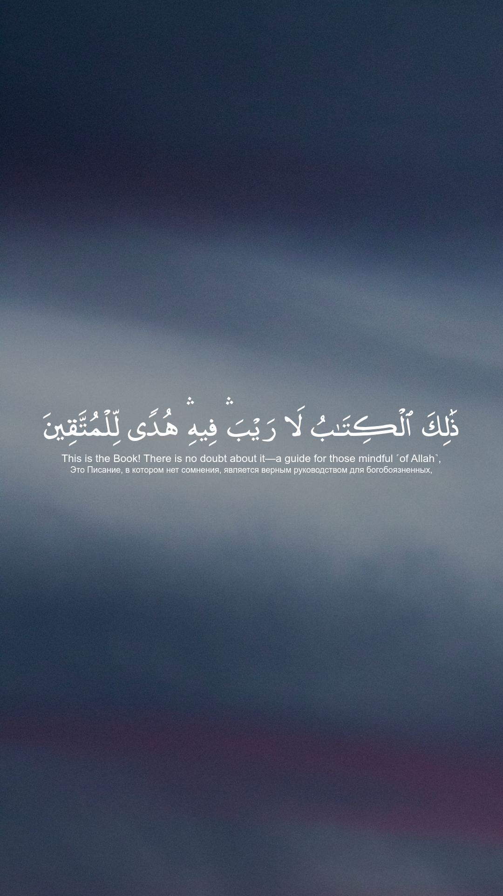
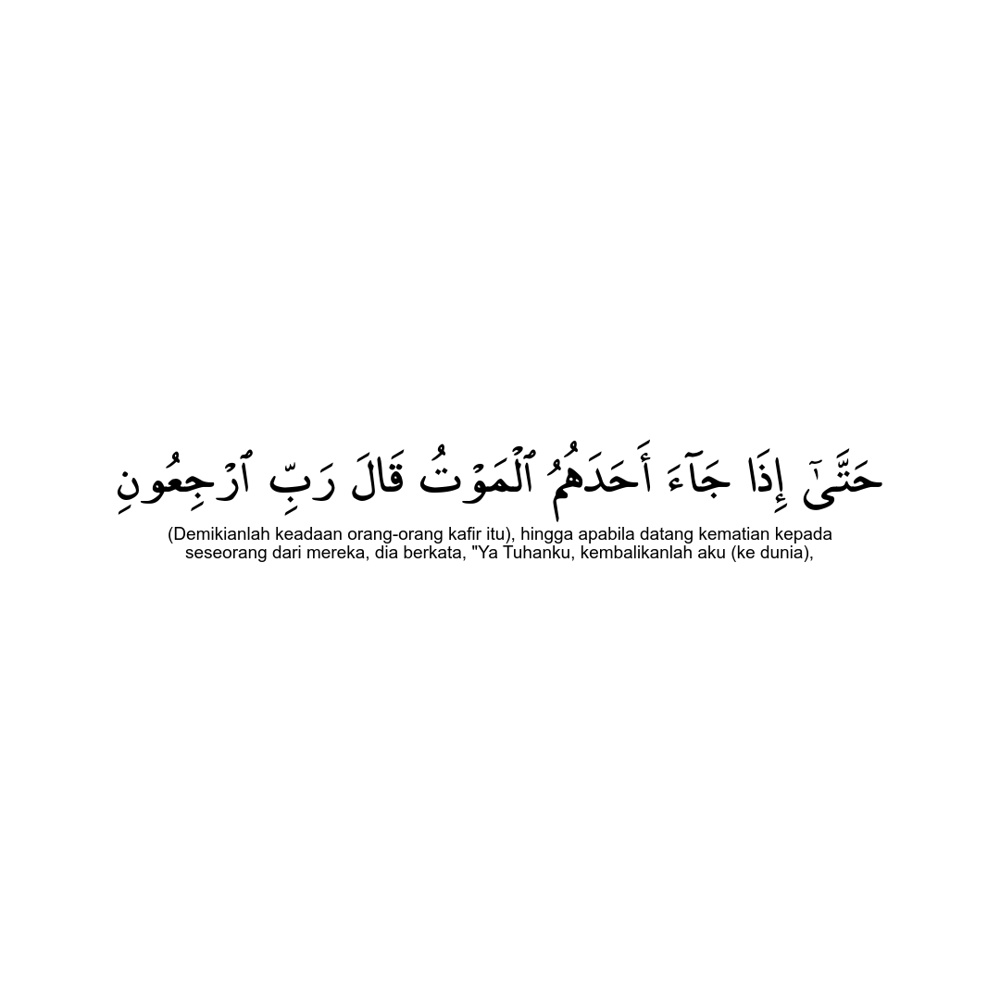

<!--
Zeyad Abbas
Quran Image Generator
-->

<!-- PROJECT SHIELDS -->
<!-- [![Contributors][contributors-shield]][contributors-url] -->
<!-- [![Forks][forks-shield]][forks-url] -->
<!-- [![Stargazers][stars-shield]][stars-url] -->
<!-- [![Issues][issues-shield]][issues-url] -->
<!-- [![MIT License][license-shield]](https://github.com/ZeyadAbbas/quran-image-generator/blob/master/LICENSE.txt) -->


<!-- PROJECT LOGO -->
<br />
<div align="center">
  <a href="https://github.com/ZeyadAbbas/quran-image-generator">
    
  </a>

<h3 align="center">Quran Image Generator</h3>

  <p align="center">
    Create custom Quran images in seconds!
    <br />
    <a href="#getting-started"><strong>How To Setup »</strong></a>
    <br />
    <br />
    <!--<a href="https://github.com/github_username/repo_name">View Demo</a>-->
    <a href="https://github.com/ZeyadAbbas/quran-image-generator/issues/new?labels=bug&template=bug-report---.md">Report Bug</a>
    ·
    <a href="https://github.com/ZeyadAbbas/quran-image-generator/issues/new?labels=enhancement&template=feature-request---.md">Request Feature</a>
  </p>
</div>


<!-- TABLE OF CONTENTS -->
<details>
  <summary>Table of Contents</summary>
  <ol>
    <li>
      <a href="#about-the-project">About The Project</a>
    </li>
    <li>
      <a href="#getting-started">Getting Started</a>
      <!-- <ul> -->
      <!--   <li><a href="#installation">Installation</a></li> -->
      <!-- </ul> -->
    </li>
    <li><a href="#usage">Usage</a></li>
    <li><a href="#to-do">To Do</a></li>
    <li><a href="#contributing">Contributing</a></li>
    <li><a href="#license">License</a></li>
    <li><a href="#contact">Contact</a></li>
    <li><a href="#acknowledgments">Acknowledgments</a></li>
  </ol>
</details>


<!-- ABOUT THE PROJECT -->
## About The Project

These are some images made using this program, and there are countless other possibilities.
<div style="display: flex; justify-content: space-around; align-items: center;">
  
  
  
</div>

<div style="display: flex; justify-content: space-around; align-items: center;">
  
  
</div>

The aim of this program is to provide people with 0 prior coding knowledge 
the ability to create custom Quran images to be shared online or for personal use.

The program allows you to generate a quran verse, translations of your choice, and then post them 
just by typing 3 sets of numbers: the chapter, the first verse, and the last verse.
This makes the generation process incredibly easy, especially when you want to make a lot of them.

Without this program, you would need to use something like [Photoshop](https://www.adobe.com/products/photoshop.html) 
or [Pixlr](https://pixlr.com/editor/) to make something like it. Both these options are paid to an extent
and take much more time to obtain the same result.

That's where my problem was. I wanted to make these images, but I didn't want to do all the work every time.
This is why I have created this program for the public use, so it's easy for myself and everyone
who may want to do the same.

The program should not take longer than 3 minutes to set up and configure. Once setup is done,
you have the ability to create countless custom images. Below are all the steps to get started.

##### This program is in beta. It may return errors if not used properly. The code and the way it works is subject to change.
<p align="right">(<a href="#about-the-project">back to top</a>)</p>


<!-- GETTING STARTED -->
## Getting Started

These instructions are all you need to get the program up and running. 
They also include all the information about the configuration options.

### Installation

You must have Python installed to run this program. \
If you don't have it installed then go to https://www.python.org/downloads/ to get the latest version of Python.

1. Once you have installed Python, you must open your Command Prompt and run the command:
    ```sh
    pip install setuptools
    ```
   It may tell you that you already have it installed, that's fine.


2. Then download and extract the program from this GitHub if you haven't already.
Make sure you know where you extracted it.

3. You must download [ImageMagick](https://docs.wand-py.org/en/latest/guide/install.html#install-imagemagick-on-windows)
to run the program.

4. Open the program's folder (that has all the python files) that you just downloaded, 
press on the top address bar, and type `cmd`.
   <div style="display: flex; justify-content: space-around; align-items: center;">
     
   </div>

   This will open a command prompt that only sees files within the program directory.


5. To download all the necessary libraries for the program to function, run:
   ```sh
   pip install .
   ```
   
6. Now you should be ready to start the program. From now on all you have to do is
open the command prompt from your program directory like done in step 3, 
then run:
   ```sh
   python main.py
   ```
   This will start the program. Now you are ready to generate custom pictures.

<p align="right">(<a href="#about-the-project">back to top</a>)</p>


<!-- USAGE EXAMPLES -->
## Usage

The program has a file that you need to open to customize the images, that file is `config.yaml`.
In there, there are options to change with descriptions next to them acting as documentation.

You have the ability to use any quran and translation fonts you like. However, there has been
ones provided for you in `assets/fonts`. If you would like to add your own, you should follow
the instructions in the config file.

There is a config option for you to generate random Quran verses for you every time you run the program.
This can be useful if you want daily Quran verses to be uploaded.

The program uses the [Quran.com](https://quran.com/1) api to get all the verses and their translations,
this means that if a language is supported by Quran.com, then it's supported by the program.

Here is a list of supported languages, and their ISO codes, that you need for the config file to use them.

| Language      | Code  | Translation Name                                       |
|---------------|-------|--------------------------------------------------------|
| English       | en    | Dr. Mustafa Khattab, The Clear Quran                   |
| Urdu          | ur    | Tafheem e Qur'an - Syed Abu Ali Maududi                |
| Bengali       | bn    | Dr. Abu Bakr Muhammad Zakaria                          |
| Turkish       | tr    | Elmalili Hamdi Yazir                                   |
| Spanish       | es    | Sheikh Isa Garcia                                      |
| French        | fr    | Muhammad Hamidullah                                    |
| Bosnian       | bs    | Besim Korkut                                           |
| Russian       | ru    | Russian Translation (Elmir Kuliev)                     |
| Malayalam     | ml    | Malayalam Translation (Abdul Hameed and Kunhi)         |
| Indonesian    | id    | Indonesian Islamic affairs ministry                    |
| Uzbek         | uz    | Muhammad Sodik Muhammad Yusuf                          |
| Dutch         | nl    | Sofian S. Siregar                                      |
| German        | de    | Frank Bubenheim and Nadeem                             |
| Tajik         | tj    | Tajik, AbdolMohammad Ayati                             |
| Tamil         | ta    | Abdul Hameed Baqavi                                    |
| Japanese      | ja    | Ryoichi Mita                                           |
| Italian       | it    | Hamza Roberto Piccardo                                 |
| Vietnamese    | vi    | Ruwwad Center, Translation Pioneers Center             |
| Chinese       | zh    | Chinese Translation (Simplified) - Ma Jain             |
| Albanian      | sq    | Albanian Translation, Sherif Ahmeti                    |
| Persian       | fa    | Hussein Taji Kal Dari                                  |
| Bulgarian     | bg    | Tzvetan Theophanov                                     |
| Bambara       | bm    | Suliman Kanti                                          |
| Hausa         | ha    | Hausa Translation (Abubakar Gumi)                      |
| Portuguese    | pt    | Portuguese Translation (Samir), Samir El-Hayek         |
| Romanian      | ro    | Grigore, George Grigore                                |
| Hindi         | hi    | Maulana Azizul Haque al-Umari                          |
| Swahili       | sw    | Dr. Abdullah Muhammad Abu Bakr and Sheikh Nasir Khamis |
| Kazakh        | kk    | Khalifah Altai                                         |
| Thai          | th    | Thai Translation (King Fahad Quran Complex)            |
| Tagalog       | tl    | Dar Al-Salam Center                                    |
| Central Khmer | km    | Cambodian Muslim Community Development                 |
| Assamese      | as    | Shaykh Rafeequl Islam Habibur-Rahman                   |
| Korean        | ko    | Hamed Choi                                             |
| Somali        | so    | Mahmud Muhammad Abduh                                  |
| Azeri         | az    | Alikhan Musayev                                        |
| Kurdish       | ku    | Muhammad Saleh Bamoki                                  |
| Malay         | ms    | Abdullah Muhammad Basmeih                              |
| Dari          | prs   | Mawlawi Muhammad Anwar Badkhashani                     |
| Amazigh       | zgh   | Ramdane At Mansour                                     |
| Amharic       | am    | Sadiq and Sani                                         |
| Chechen       | ce    | Magomed Magomedov                                      |
| Divehi        | dv    | Office of the president of Maldives                    |
| Czech         | cs    | Czech                                                  |
| Finnish       | fi    | Finnish                                                |
| Gujarati      | gu    | Rabila Al-Umry                                         |
| Hebrew        | he    | Dar Al-Salam Center                                    |
| Kannada       | kn    | Kannada Translation                                    |
| Ganda         | lg    | African Development Foundation                         |
| Marathi       | mr    | Muhammad Shafi’i Ansari                                |
| Maranao       | mrn   | Maranao                                                |
| Nepali        | ne    | Ahl Al-Hadith Central Society of Nepal                 |
| Norwegian     | no    | Norwegian                                              |
| Oromo         | om    | Ghali Apapur Apaghuna                                  |
| Polish        | pl    | Józef Bielawski                                        |
| Pashto        | ps    | Zakaria Abulsalam                                      |
| Kinyarwanda   | rw    | The Rwanda Muslims Association team                    |
| Sindhi        | sd    | Taj Mehmood Amroti                                     |
| Sinhala       | si    | Ruwwad Center, Translation Pioneers Center             |
| Swedish       | sv    | Knut Bernström                                         |
| Telugu        | te    | Maulana Abder-Rahim ibn Muhammad                       |
| Tatar         | tt    | Tatar                                                  |
| Uyghur        | ug    | Muhammad Saleh                                         |
| Ukrainian     | uk    | Dr. Mikhailo Yaqubovic                                 |
| Yoruba        | yo    | Shaykh Abu Rahimah Mikael Aykyuni                      |

#### These languages were not proof read by me. I only speak Arabic and English.
If you want to change the translation currently in use, you may change it in the 
`translation_codes` folder.


The program gives you the ability to automatically post your images online once generated.
You can set this option in the config file to either, true, false, or ask.
You can also pick where you want to post the image.

To use this feature, you must be connected to WI-FI and you must provide your username and
password in the appropriate fields in the config file.

This is a list of currently supported post methods:
* Instagram
  * Story (insta_story)
  * Post (insta_post)

#### Your username and password cannot be viewed by me, or anyone online. The program only requires this to post your image.

<p align="right">(<a href="#about-the-project">back to top</a>)</p>


<!-- To Do -->
## To Do

- [ ] Change the way read_config.py works
- [ ] Add the ability to post automatically based on an interval
- [ ] Add bounds to ensure no errors occur
- [ ] Add more post method support
- [ ] Create program to test all config options
- [ ] Comment code
    - [ ] Add error logs

See the [open issues](https://github.com/ZeyadAbbas/quran-image-generator/issues) for a full list of proposed features (and known issues).

<p align="right">(<a href="#about-the-project">back to top</a>)</p>


<!-- CONTRIBUTING -->
## Contributing

Contributions are what make the open source community such an amazing place to learn, inspire, and create. Any contributions you make are **greatly appreciated**.

If you have a suggestion that would make this better, please fork the repo and create a pull request. You can also simply open an issue with the tag "enhancement".
Don't forget to give the project a star! Thanks again!

1. Fork the Project
2. Create your Feature Branch (`git checkout -b feature/AmazingFeature`)
3. Commit your Changes (`git commit -m 'Add some AmazingFeature'`)
4. Push to the Branch (`git push origin feature/AmazingFeature`)
5. Open a Pull Request

<p align="right">(<a href="#about-the-project">back to top</a>)</p>


<!-- LICENSE -->
## License

Distributed under the MIT License. See `LICENSE.txt` for more information.

<p align="right">(<a href="#about-the-project">back to top</a>)</p>


<!-- CONTACT -->
## Contact

Zeyad Abbas - zeyadabbas238@gmail.com

[![LinkedIn][linkedin-shield]](https://www.linkedin.com/in/zeyad-abbas-/)

Project Link: [https://github.com/ZeyadAbbas/quran-image-generator](https://github.com/ZeyadAbbas/quran-image-generator)

<p align="right">(<a href="#about-the-project">back to top</a>)</p>


<!-- ACKNOWLEDGMENTS -->
## Acknowledgments

* [Quran.com](https://quran.com/1)
* [me_quran Quran Font](https://tanzil.net/docs/me_quran_font)
* [Different Language Fonts](https://fonts.google.com/noto)

<p align="right">(<a href="#about-the-project">back to top</a>)</p>


<!-- MARKDOWN LINKS & IMAGES -->
<!-- https://www.markdownguide.org/basic-syntax/#reference-style-links -->
[linkedin-shield]: https://img.shields.io/badge/-LinkedIn-black.svg?style=for-the-badge&logo=linkedin&colorB=555
[linkedin-url]: https://linkedin.com/in/linkedin_username
